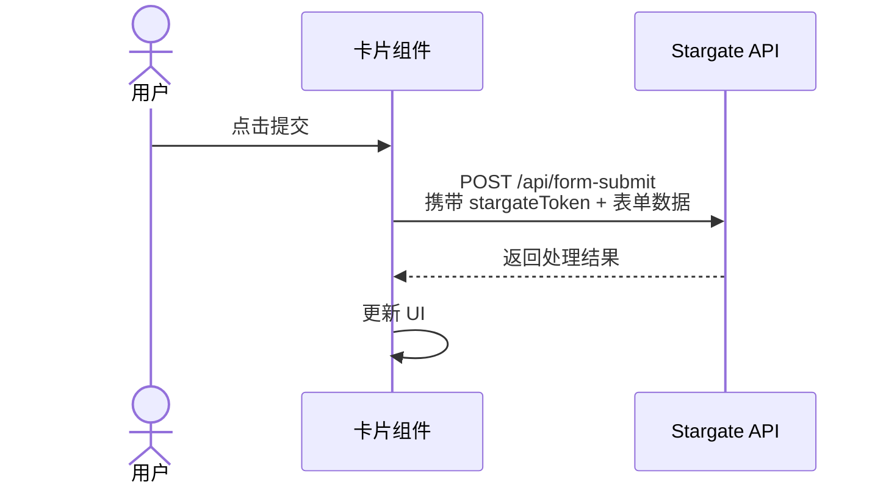
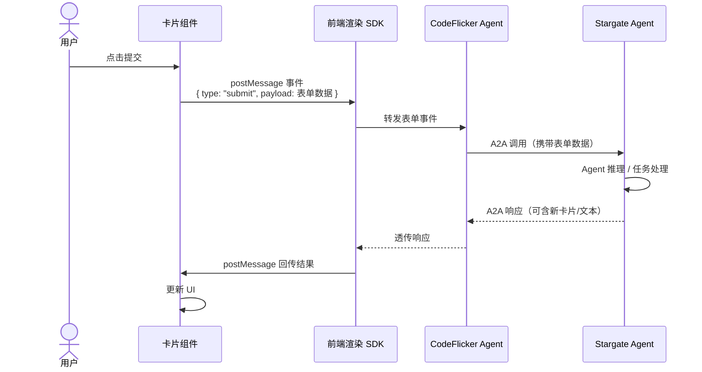

[2026-04-09 11:52:14] [user]: /spec:brainstorm 
根据这个文档及相关文档 https://docs.corp.kuaishou.com/d/home/fcAA3nK5BQnCv9YlfTzHM_npp 聊几个事情
1. 先聊清楚我们要干什么？找到其中的难点和疑问项
2. 根据这几个目标和关键点，我们怎么干？
[2026-04-09 11:52:14] [user]: # Brainstorming Ideas Into Designs

## Overview

Transform rough ideas into fully-formed designs through structured questioning and alternative exploration.

**Core principle:** Ask questions to understand, explore alternatives, present design incrementally for validation.

**Announce at start:** "I'm refining your idea into a design."

**Language:** Please communicate in 中文.

## CRITICAL CONSTRAINTS
- **DO NOT WRITE CODE** (except small snippets for illustration).
- **DO NOT EDIT FILES**.
- This is a **DESIGN** phase, not an implementation phase.
- Even if the input looks like a coding task, you must TREAT IT AS A TOPIC FOR DESIGN DISCUSSION first.

## The Process

### Phase 1: Understanding
- Check current project state in working directory
- Ask ONE question at a time to refine the idea

- **IMPORTANT: Use AskUserQuestion tool when asking clarification questions**

- Prefer multiple choice when possible
- Gather: Purpose, constraints, success criteria

### Phase 2: Exploration
- Propose 2-3 different approaches
- For each: Core architecture, trade-offs, complexity assessment
- Ask your human partner which approach resonates

### Phase 3: Design Presentation
- Present in 200-300 word sections
- Cover: Architecture, components, data flow, error handling, testing
- Ask after each section: "Does this look right so far?"

## When to Revisit Earlier Phases

**You can and should go backward when:**
- Partner reveals new constraint during Phase 2 or 3 → Return to Phase 1 to understand it
- Validation shows fundamental gap in requirements → Return to Phase 1
- Partner questions approach during Phase 3 → Return to Phase 2 to explore alternatives
- Something doesn't make sense → Go back and clarify

**Don't force forward linearly** when going backward would give better results.

## Remember
- One question per message during Phase 1
- Apply YAGNI ruthlessly
- Explore 2-3 alternatives before settling
- Present incrementally, validate as you go
- Go backward when needed - flexibility > rigid progression
- Don't edit or write code during brainstorming

Arguments: 根据这个文档及相关文档 https://docs.corp.kuaishou.com/d/home/fcAA3nK5BQnCv9YlfTzHM_npp 聊几个事情
1. 先聊清楚我们要干什么？找到其中的难点和疑问项
2. 根据这几个目标和关键点，我们怎么干？
[2026-04-09 11:52:20] [assistant]: 我正在为你精炼这个想法，转化为设计方案。

先读一下文档内容。
[2026-04-09 11:52:47] [assistant]: 好，我已经读完了主文档和调研文档。让我整理一下核心内容，然后开始讨论。

---

## Phase 1：我们要干什么？

**核心目标总结：**

在 A2A 协议体系下，实现跨 Agent 的 UI 渲染能力。具体来说就是：当 CodeFlicker（调用方 Agent）调用 Stargate/Lumos（被调用方 Agent）时，被调用方能返回 HTML/Card 形式的 UI，调用方能正确识别并渲染出来。

**四个产出物：**
1. **数据结构（P0）**：A2A 协议中扩展的 HTML/Card 渲染协议结构
2. **card instance 生产/消费方案（P0）**：Stargate 将卡片组件代码+spec 组装为实例，前端通过 cardInstanceId 获取并渲染
3. **前端渲染 SDK（P0）**：基于 MCP UI 实现
4. **通用转化函数（P1）**：client agent 将 remote agent 返回的结构转为前端可消费的结构

---

**我识别到的难点和疑问项：**

**难点：**
- iframe 方案中的**登录打通**问题（跨域 cookie/token）
- 卡片**访问鉴权**问题（谁能渲染哪张卡片）
- A2A 协议是否有足够的扩展点支持 `extensions` + `metadata` 这套 mcp-apps-ui 扩展
- card instance 的**生命周期管理**：何时创建、何时过期、如何唯一标识

**疑问项：**
- 基础卡片（场景③）直接转 HTML 片段 vs 业务自定义卡片（场景④）用 iframe，这两条路在 SDK 层如何统一？
- MCP UI 的能力边界是什么？文档说"尽量使用 MCP UI 实现完整功能"，但 MCP UI 本身的成熟度如何？
- Stargate 在这个方案里的角色是什么——是卡片注册中心？还是渲染代理？还是两者都是？

---
[2026-04-09 11:58:02] [assistant]: 好，这个清楚了。Stargate 是一个 Agent，资源管理中心是它的配套系统，卡片只是其中一类资源。

所以整个链路应该是：

```
用户 → CodeFlicker（调用方 Agent）
         ↓ A2A 协议调用
       Stargate Agent
         ↓ 查询
       资源管理中心（卡片组件代码 + spec）
         ↓ 组装
       card instance（含 cardInstanceId）
         ↓ 返回 A2A 响应
       CodeFlicker 前端
         ↓ 用 cardInstanceId 拉取并渲染
       iframe / SDK 渲染
```

这个链路理解是否正确，我再问一个关键疑问：
[2026-04-09 14:21:35] [user]: 继续
[2026-04-09 14:21:49] [assistant]: 好，明确了：**Stargate = 一个 Agent + 背后有资源管理中心，卡片只是其中一类资源。**

那流程就更清晰了：CodeFlicker 调用 Stargate Agent → Stargate 从资源管理中心取出卡片组件+spec → 组装为 card instance → 通过 A2A 协议返回给 CodeFlicker → 前端渲染。
[2026-04-09 14:23:08] [assistant]: 好，渲染方式待设计——这正是核心设计决策之一，我们后面 Phase 2 会重点探讨。

再确认一个关键边界问题：
[2026-04-09 14:24:42] [assistant]: 好，目标清晰了。现在我有足够的信息来梳理难点全图，进入 Phase 2 之前先对齐一下：

---

## Phase 1 小结：我们要干什么？

**一句话目标：** 在 A2A 协议下，实现 CodeFlicker 调用 Stargate Agent 并渲染其返回的业务自定义卡片的完整能力，产出设计方案 + 可演示的 Demo。

---

### 核心链路
```
CodeFlicker Agent
  → (A2A 协议) → Stargate Agent
  → 从资源管理中心取卡片组件+spec
  → 组装为 card instance（生成 cardInstanceId）
  → (A2A 响应) → CodeFlicker 前端
  → 渲染 SDK 消费 cardInstanceId → 用户看到卡片
```

---

### 难点清单

| # | 难点 | 优先级 |
|---|------|--------|
| 1 | **A2A 协议扩展结构**：如何在标准 A2A message 里携带 card 渲染信息（extensions/metadata 字段设计） | P0 |
| 2 | **card instance 方案**：Stargate 如何将组件代码+spec 组装为实例，cardInstanceId 的生命周期、存储在哪 | P0 |
| 3 | **前端渲染方式**：iframe vs 沙箱执行 vs SDK 拉取渲染，安全性/性能/登录态各不同 | P0 |
| 4 | **登录态打通**：iframe 跨域场景下 CodeFlicker 和 Stargate 资源中心的登录态如何共享 | P0 |
| 5 | **卡片访问鉴权**：cardInstanceId 是否公开可访问，还是需要 token | P0 |
| 6 | **通用转化函数**：client agent 侧如何识别 A2A 响应中的 card 数据并转为 SDK 可消费格式 | P1 |

---

现在进入 **Phase 2：我们怎么干？**

核心是三个子问题，我一个一个来探讨。先聊最核心的：

---

## Phase 2-A：前端渲染方式

三种方案：

**方案一：iframe 渲染**
- Stargate 生成 cardInstanceId，前端用 `<iframe src="https://stargate.ks.com/card/{cardInstanceId}">` 渲染
- 优点：完全隔离、安全、支持复杂交互
- 缺点：登录态需要打通（SSO/postMessage），跨域通信麻烦

**方案二：内容下发 + 沙箱执行**
- Stargate 直接在 A2A 响应里返回 HTML/JS 字符串，前端在沙箱（如 `<iframe srcdoc>` 或 `shadow DOM + eval`）里执行
- 优点：无需登录态打通，链路简单
- 缺点：安全隔离要求高，JS 执行沙箱复杂，大卡片性能差

**方案三：SDK 拉取 + 本地渲染（MCP UI 方向）**
- 返回 cardInstanceId + resourceUri，前端 SDK 调 API 拿到卡片 spec，本地用组件库渲染
- 优点：渲染性能好、样式统一
- 缺点：需要前端内置组件库，依赖 spec 标准化程度
[2026-04-09 14:29:55] [assistant]: 好，方向定了：**SDK 渲染 + 基于 mcp-ui 扩展**。先读一下 mcp-ui-protocol.md 的内容。
[2026-04-09 14:30:22] [assistant]: 现在有完整信息了。整合一下，进入完整的 Phase 2 设计。

---

## Phase 2 整体方案设计

### 核心架构图

```
[用户] → [CodeFlicker 前端]
              ↓ 发起任务
         [CodeFlicker Agent]
              ↓ A2A 调用（携带 task）
         [Stargate Agent]
              ↓ 查询资源管理中心
         [卡片组件 + spec]
              ↓ 组装 card instance
         返回 A2A 响应（含 resourceUri: ui://card/{instanceId}）
              ↓
         [CodeFlicker Agent] 透传给前端
              ↓
         [前端渲染 SDK]（基于 mcp-ui 扩展）
              ↓ 调用 Stargate 资源 API
         [Card Instance 内容]（HTML 字符串）
              ↓
         渲染到页面
```

---

### 子模块设计

**① A2A 协议扩展结构（P0）**

在 A2A message 的 `parts` 里，增加一个 `kind: "mcp_ui_resource"` 的 part：

```json
{
  "kind": "mcp_ui_resource",
  "resourceUri": "ui://stargate/card/{cardInstanceId}",
  "uiMetadata": {
    "preferred-frame-size": { "width": 400, "height": 300 }
  }
}
```

这与 mcp-ui 的 `ui://` URI 约定完全对齐，不需要额外的 extensions 字段，链路更干净。

---

**② Card Instance 生产方案（P0）**

Stargate Agent 收到调用后：
1. 从资源管理中心拉取：卡片组件代码（HTML/JS）+ spec（参数）
2. 将 spec 参数注入组件，生成一个静态 HTML 快照
3. 存入短期缓存（如 Redis），key = `cardInstanceId`（UUID），TTL 建议 24h
4. 返回 `ui://stargate/card/{cardInstanceId}`

---

**③ 前端渲染 SDK（P0）**

基于 mcp-ui 的 `createUIResource` 机制扩展：
- SDK 识别 `ui://stargate/card/*` 格式的 URI
- 调用 Stargate 资源 API：`GET /api/card-instance/{cardInstanceId}` 拿到 HTML 内容
- 用 `rawHtml` 模式 + `<iframe srcdoc>` 渲染（隔离样式，无跨域登录问题）

> 关键点：这里用的是 `srcdoc` 而非 `src`，HTML 内容由 SDK 从 API 拿到再注入，所以**不存在跨域登录问题**——登录态在 API 调用层面解决（CodeFlicker 用统一 token 调 Stargate API 即可）。

---

**④ 通用转化函数（P1）**

CodeFlicker Agent 侧：扫描 A2A 响应的 parts，识别 `kind: "mcp_ui_resource"` 的 part，透传 `resourceUri` 给前端 SDK。

---

### 遗留问题处理

| 问题 | 方案 |
|---|---|
| 鉴权 | API 调用携带 CodeFlicker 的 user token，Stargate 验证权限 |
| 登录态 | 用 srcdoc 模式绕开，API 层统一走 token |
| 卡片过期 | cardInstanceId TTL 24h，过期返回占位提示 |

---

这个方案看起来如何？有没有哪个环节你觉得有问题或者想深入聊的？
[2026-04-09 14:35:00] [user]: 再聊聊前端渲染 SDK
1. 预期渲染的卡片可根据用户的交互获取数据，使用 srcdoc 的方式可以实现吗？
[2026-04-09 14:35:23] [assistant]: 这是个很好的问题，直接关系到 srcdoc 方案的可行性边界。

---

## srcdoc 能支持交互式数据获取吗？

**可以，但有细节要搞清楚。**

### srcdoc 的关键特性

`srcdoc` iframe 的内容被视为**与父页面同源**，这意味着：

- 卡片内的 JS 可以直接 `fetch` API（继承父页面的 origin）
- Cookie / Session 等认证信息**自动共享**
- 不存在跨域限制

所以用户交互触发的数据请求（如点击按钮查询数据）是完全可行的。

---

### 但有一个核心问题：卡片如何拿到请求所需的上下文？

卡片里的 JS 不知道当前用户是谁、token 是什么。需要一个**父页面 → 卡片 的初始化数据注入机制**。

mcp-ui 的 `@modelcontextprotocol/ext-apps` 的 `App` 类正好解决这个问题——它用 `postMessage` 实现双向通信：

```
父页面（SDK）  ──postMessage──▶  iframe 内 App
父页面（SDK）  ◀──postMessage──  iframe 内 App（请求数据/上报事件）
```

mcp-ui 协议里的 `initial-render-data` 就是初始化时注入上下文数据的标准字段。
[2026-04-09 14:36:45] [assistant]: 好，**卡片自己调 API**。那 srcdoc 方案就非常合适，具体分析：

---

## 卡片自己调 API + srcdoc 方案

### 完全可行，关键点如下：

**1. 同源请求无障碍**

`srcdoc` iframe 继承父页面 origin，卡片内 `fetch('/api/xxx')` 直接走，Cookie 自动带上，**无需任何特殊处理**。

**2. 认证上下文注入**

如果 Stargate API 需要的不是 Cookie 而是显式 token，SDK 在渲染时通过 `initial-render-data` 注入：

```json
{
  "userToken": "xxx",
  "env": "production"
}
```

卡片内 App 类初始化时读取这个数据，后续请求带上 token。

**3. 交互数据流**

```
用户点击卡片按钮
  → 卡片 JS fetch('https://stargate.ks.com/api/data')
  → 带 token（来自 initial-render-data）
  → 返回数据 → 卡片更新 UI
```

完全在 iframe 内闭环，父页面无感知。

---

### srcdoc 的一个限制需要注意

`srcdoc` 里的相对路径资源（图片、JS 文件）**无法加载**，卡片内所有资源引用必须是**绝对 URL**。

这对 Stargate 生成 card instance 有要求：组装 HTML 时，所有 `src`/`href` 都要转为绝对路径。

---

### 结论

| 能力 | srcdoc 支持情况 |
|---|---|
| 用户交互触发 fetch | ✅ 完全支持 |
| Cookie 认证 | ✅ 自动继承 |
| Token 注入 | ✅ 通过 initial-render-data |
| 相对路径资源 | ❌ 需要转绝对路径 |
| 卡片间通信 | ✅ postMessage |

**srcdoc 方案成立，Stargate 生成 HTML 时需要保证所有资源使用绝对路径。**

这块还有什么疑问？或者要继续聊 SDK 的其他部分？
[2026-04-09 14:40:45] [user]: 这要求 stargate 生成的 card instance 是 html 和 js 代码？而不是 react 代码？
[2026-04-09 14:41:15] [assistant]: 对，这是一个很关键的问题，直接影响 Stargate 的 card instance 生产方案。

---

## 两种路径的对比

**路径 A：Stargate 输出 HTML + 纯 JS（当前方案）**
- srcdoc 直接渲染，无需编译
- 要求资源管理中心存的是**已构建产物**（bundle 后的 HTML/JS）
- 或者 Stargate 在生产 instance 时**实时构建**（成本高）

**路径 B：Stargate 输出 React 组件代码**
- srcdoc 本身无法直接跑 JSX/TSX
- 需要前端 SDK 在运行时动态加载并执行 React 组件

路径 B 有两种实现方式：

1. **Module Federation / ESM 远程加载**：Stargate 提供一个 JS bundle URL，SDK 动态 `import()` 进来，在当前 React 环境里挂载渲染——**不用 srcdoc，直接渲染到 DOM**
2. **srcdoc + React runtime 注入**：HTML 里引入 React CDN，再注入组件代码——可行但很脏
[2026-04-09 14:44:35] [assistant]: 这个方向很清晰，Module Federation 是处理这个场景的标准解法。这样 **srcdoc 方案就退出了**，渲染方式需要调整。

---

## 新渲染架构：Module Federation 动态加载

### 整体链路调整

```
Stargate 资源管理中心
  → 存储：React 组件源码
  → 构建：每个卡片打包为独立 MF remote（暴露 ./Card 入口）
  → 托管：bundle URL，如 https://stargate.ks.com/mf/{cardId}/remoteEntry.js

Stargate Agent
  → 组装 card instance：{ cardId, props（spec 参数）, remoteEntryUrl }
  → 存入缓存，返回 cardInstanceId

前端 SDK
  → 拿到 cardInstanceId
  → GET /api/card-instance/{cardInstanceId} 获取 { remoteEntryUrl, props }
  → 动态 import(remoteEntryUrl) 加载 MF remote
  → 在当前 React 树里直接渲染 <RemoteCard {...props} />
```

---

### 关键优势

- 卡片运行在**主页面 React 环境**里，可以直接调 API、使用 hooks，无任何沙箱限制
- 不需要 srcdoc，资源路径问题消失
- 卡片样式和主页面可以隔离（CSS Modules / Shadow DOM）也可以共享设计 token

### 新的需要设计的问题

1. **React 版本冲突**：卡片的 React 版本和 CodeFlicker 主应用的版本如果不一致怎么处理？→ MF 的 `shared` 配置里声明 React 为 singleton
2. **加载失败兜底**：remoteEntry.js 加载失败时 SDK 要有 ErrorBoundary + fallback UI
3. **卡片隔离**：卡片的全局样式污染主页面怎么防？

---

这三个问题里，你现在最想深入哪个，还是直接看完整 SDK 的设计？
[2026-04-09 15:25:16] [user]: Stargate 资源管理中心中不存储 React 组件源码，会存储组件名称和组件所在库的 remoteEntry.js。
更新这个链路
[2026-04-09 15:25:34] [assistant]: 明白了，这个信息很关键——卡片组件已经以**组件库**的形式存在并托管好了，Stargate 资源中心只是做**索引**。

更新后的链路：

---

## 更新后的链路

```
Stargate 资源管理中心
  → 存储：{ componentName: "SalesDashboard", remoteEntryUrl: "https://cdn.ks.com/lumos-cards/remoteEntry.js" }

Stargate Agent
  → 收到调用，查询资源管理中心，拿到 componentName + remoteEntryUrl
  → 结合本次调用的业务参数，组装 card instance：
    { componentName, remoteEntryUrl, props }
  → 存入缓存，生成 cardInstanceId
  → 通过 A2A 协议返回 cardInstanceId

前端 SDK
  → GET /api/card-instance/{cardInstanceId}
  → 拿到 { componentName, remoteEntryUrl, props }
  → 动态加载 remoteEntry.js（Module Federation）
  → 从 remote 中取出 componentName 对应的组件
  → 渲染 <RemoteComponent {...props} />
```

---

### 和之前的核心差异

| | 之前 | 现在 |
|---|---|---|
| 资源中心存什么 | 组件源码 | componentName + remoteEntryUrl |
| 构建在哪做 | Stargate 构建 | 组件库 CI 构建，与 Stargate 无关 |
| card instance 内容 | HTML 快照 | componentName + remoteEntryUrl + props |
| Stargate 职责 | 重（需构建） | 轻（只做索引+参数组装） |

---

这个链路有没有什么疑问？还是继续聊 SDK 这侧动态加载的细节？
[2026-04-09 15:29:57] [user]: 使用 cardInstanceId 的优劣势是什么？直接使用 A2A 协议返回  componentName, remoteEntryUrl, props 可以吗？对比一下
[2026-04-09 15:30:26] [assistant]: 好问题，这是一个**有无中间层**的经典设计取舍。

---

## 对比

| 维度 | cardInstanceId 中间层 | 直接返回三元组 |
|---|---|---|
| **协议大小** | 轻（只传一个 id） | 中等（props 可能很大） |
| **鉴权控制** | ✅ 服务端可控，cardInstanceId 可设权限/过期 | ❌ 数据直接暴露在 A2A 消息里 |
| **props 安全** | ✅ 敏感业务数据留在服务端 | ❌ props 明文在协议里传输 |
| **链路复杂度** | 多一次 API 请求 | 前端拿到即可渲染，无额外请求 |
| **可追踪性** | ✅ 服务端有 instance 记录，可审计 | ❌ 无记录 |
| **灵活性** | Stargate 可随时修改 instance 内容 | 数据已下发，无法撤回 |
| **离线/缓存** | ❌ instance 过期后无法渲染 | ✅ 数据在客户端，不依赖服务端 |
| **实现成本** | 需要缓存服务（Redis 等） | 零额外基础设施 |

---

## 关键判断因素

**props 里有没有敏感数据？**

- 如果 props 只是展示参数（如标题、颜色、图表配置），直接返回三元组完全合理，链路更简单
- 如果 props 包含业务敏感数据（如用户数据、权限相关内容），cardInstanceId 更安全
[2026-04-09 15:31:28] [assistant]: 那 **cardInstanceId 方案是必要的**，敏感 props 不能明文走 A2A 协议。

结论很清晰：

- **A2A 协议只传 cardInstanceId**，敏感 props 留在服务端
- 前端 SDK 持 cardInstanceId + 用户 token 去 Stargate API 换取内容，服务端在这一步做**鉴权 + 数据脱敏**
- Stargate 也可以按需控制 instance 的可见性和过期策略

这个决策定了。要继续聊 SDK 动态加载的细节，还是回头看整体设计还有哪些没覆盖到的点？
[2026-04-09 15:31:50] [user]: 再看下整体链路
[2026-04-09 15:32:27] [assistant]: 基于所有讨论，梳理完整链路如下：

---

## 完整链路

```
┌─────────────────────────────────────────────────────┐
│ 1. 调用阶段                                          │
│                                                     │
│  用户 → CodeFlicker 前端 → CodeFlicker Agent        │
│                              ↓ A2A 协议              │
│                          Stargate Agent             │
│                              ↓                      │
│                       资源管理中心                   │
│                    查询 componentName               │
│                       + remoteEntryUrl              │
└─────────────────────────────────────────────────────┘
                              ↓
┌─────────────────────────────────────────────────────┐
│ 2. Card Instance 生产阶段                            │
│                                                     │
│  Stargate Agent                                     │
│    → 将 { componentName, remoteEntryUrl, props }    │
│      存入缓存（TTL 24h）                             │
│    → 生成 cardInstanceId                            │
│    → A2A 响应返回：                                 │
│      { kind: "mcp_ui_resource",                     │
│        resourceUri: "ui://stargate/card/{id}" }     │
└─────────────────────────────────────────────────────┘
                              ↓
┌─────────────────────────────────────────────────────┐
│ 3. 前端渲染阶段                                      │
│                                                     │
│  CodeFlicker Agent                                  │
│    → 识别 mcp_ui_resource part，透传给前端           │
│                                                     │
│  前端渲染 SDK（基于 mcp-ui 扩展）                    │
│    → 解析 resourceUri，提取 cardInstanceId          │
│    → GET /api/card-instance/{id}（携带 user token） │
│    → Stargate 鉴权后返回：                          │
│      { componentName, remoteEntryUrl, props }       │
│    → 动态加载 remoteEntry.js（Module Federation）   │
│    → 渲染 <RemoteComponent {...props} />            │
└─────────────────────────────────────────────────────┘
                              ↓
┌─────────────────────────────────────────────────────┐
│ 4. 卡片交互阶段                                      │
│                                                     │
│  卡片组件自身调用 Stargate/业务 API 获取数据         │
│  （token 由 SDK 通过 initial-render-data 注入）     │
└─────────────────────────────────────────────────────┘
```

---

## 各模块职责

| 模块 | 职责 |
|---|---|
| **Stargate 资源管理中心** | 存储 componentName + remoteEntryUrl 的索引 |
| **Stargate Agent** | 组装 card instance，管理缓存，鉴权 |
| **A2A 协议扩展** | 在 parts 里携带 `mcp_ui_resource` + `resourceUri` |
| **CodeFlicker Agent** | 识别并透传 `mcp_ui_resource`，不做额外处理 |
| **前端渲染 SDK** | 换取 instance 内容，MF 动态加载，组件渲染 |
| **卡片组件库** | 独立构建，暴露 remoteEntry.js |

---

## 待确认的风险点

| 风险 | 说明 |
|---|---|
| **React 版本冲突** | MF shared 配置需声明 React 为 singleton |
| **remoteEntry 加载失败** | SDK 需要 ErrorBoundary + fallback UI |
| **cardInstanceId 过期** | 24h TTL 是否满足业务场景，需确认 |
| **token 注入时机** | SDK 在渲染前需拿到有效 user token |

---

整体链路看起来如何？有没有哪个环节觉得有问题？
[2026-04-09 15:37:37] [user]: 1. React 版本冲突 和 remoteEntry 加载失败的处理按照你的来
2. cardInstanceId 过期时间我现在确定不了，保留这个疑问，评审时确认
3. token 注入时机，我们再聊一下
[2026-04-09 16:00:56] [assistant]: 好，这就引出了一个时序问题：

---

## Token 注入时机分析

### 问题所在

卡片渲染需要 Stargate token，但 Stargate token 不是现成的，需要用 CodeFlicker token 换取。换取是异步操作，而 SDK 渲染卡片也是异步的。

两者的时序关系有三种可能：

---

**方案 A：SDK 渲染前换 token（串行）**

```
SDK 收到 cardInstanceId
  → 换取 Stargate token（异步）
  → 拿到 token 后才开始渲染卡片
  → initial-render-data 注入 token
```

- 优点：卡片初始化时 token 一定存在，简单可靠
- 缺点：多一次串行请求，首屏渲染慢

---

**方案 B：SDK 渲染和换 token 并行**

```
SDK 收到 cardInstanceId
  → 同时：① 换取 Stargate token  ② 加载 remoteEntry.js
  → 两者都完成后，注入 token，渲染卡片
```

- 优点：换 token 和加载组件并行，时间最短
- 缺点：SDK 需要协调两个异步任务

---

**方案 C：token 由上层提前准备，SDK 被动接收**

```
CodeFlicker 前端（上层）
  → 在页面初始化时就换好 Stargate token，存入 context/store
  → SDK 渲染时直接从 context 读取，无需自己换
```

- 优点：SDK 职责单一，不感知 token 换取逻辑
- 缺点：要求宿主（CodeFlicker 前端）提前完成换 token
[2026-04-09 16:01:38] [assistant]: 好，方案 A 串行，简单可靠。更新后的 SDK 渲染阶段完整时序：

---

## 更新后的渲染阶段时序

```
前端 SDK 收到 resourceUri（含 cardInstanceId）
  ↓
① GET /api/card-instance/{cardInstanceId}     ← 携带 CodeFlicker token
  Stargate 鉴权，返回 { componentName, remoteEntryUrl, props }
  ↓
② 用 CodeFlicker token 换取 Stargate token
  ↓
③ 动态加载 remoteEntry.js（Module Federation）
  ↓
④ 渲染 <RemoteComponent {...props} />
   initial-render-data 注入 stargateToken
  ↓
卡片交互时自己带 stargateToken 调 API
```

---

## 补充：Token 刷新问题

串行方案有一个后续需要考虑的点：**Stargate token 过期后怎么办？**

卡片可能长时间停留在页面上，token 过期后调用 API 会 401。两种处理方式：

1. **卡片内自行刷新**：卡片捕获 401，通过 `postMessage` 通知 SDK 重新换 token，SDK 换好后再 `postMessage` 回传
2. **SDK 定时刷新**：SDK 维护 token 的有效期，提前刷新并通过 `initial-render-data` 更新

这个作为**待评审项**保留，和 cardInstanceId TTL 一起确认。

---

## 当前全部待评审项

| # | 问题 |
|---|---|
| 1 | cardInstanceId TTL 设多长？ |
| 2 | Stargate token 过期后的刷新机制 |

整体设计到这里基本完整了，要输出一份汇总的设计文档吗？
[2026-04-09 16:02:50] [user]: 看一下整体流程
[2026-04-09 16:03:13] [assistant]: ## 完整设计方案

---

### 整体链路

```
┌─────────────────────────────────────────────────────────┐
│ 1. 调用阶段                                              │
│                                                         │
│  用户 → CodeFlicker 前端                                │
│              ↓                                          │
│         CodeFlicker Agent                               │
│              ↓ A2A 协议                                 │
│         Stargate Agent                                  │
│              ↓                                          │
│         资源管理中心                                     │
│         查询 { componentName, remoteEntryUrl }          │
└─────────────────────────────────────────────────────────┘
                         ↓
┌─────────────────────────────────────────────────────────┐
│ 2. Card Instance 生产阶段                                │
│                                                         │
│  Stargate Agent                                         │
│    → 组装 { componentName, remoteEntryUrl, props }      │
│    → 存入缓存（TTL 待评审）                              │
│    → 生成 cardInstanceId                                │
│    → A2A 响应：                                         │
│      {                                                  │
│        kind: "mcp_ui_resource",                         │
│        resourceUri: "ui://stargate/card/{id}"           │
│      }                                                  │
└─────────────────────────────────────────────────────────┘
                         ↓
┌─────────────────────────────────────────────────────────┐
│ 3. 前端渲染阶段                                          │
│                                                         │
│  CodeFlicker Agent                                      │
│    → 识别 mcp_ui_resource part，透传给前端              │
│                                                         │
│  前端渲染 SDK（基于 mcp-ui 扩展）                        │
│    ① GET /api/card-instance/{id}                        │
│       携带 CodeFlicker token → Stargate 鉴权            │
│       返回 { componentName, remoteEntryUrl, props }     │
│    ② 用 CodeFlicker token 换取 Stargate token           │
│    ③ 动态加载 remoteEntry.js（Module Federation）       │
│       - React 声明为 singleton，避免版本冲突             │
│       - 加载失败进入 ErrorBoundary，展示 fallback UI    │
│    ④ 渲染 <RemoteComponent {...props} />                │
│       initial-render-data 注入 stargateToken            │
└─────────────────────────────────────────────────────────┘
                         ↓
┌─────────────────────────────────────────────────────────┐
│ 4. 卡片交互阶段                                          │
│                                                         │
│  卡片组件自身携带 stargateToken 调用业务 API             │
│  数据返回后卡片内部更新 UI                               │
└─────────────────────────────────────────────────────────┘
```

---

### 各模块职责

| 模块 | 职责 |
|---|---|
| **Stargate 资源管理中心** | 存储 componentName + remoteEntryUrl 索引 |
| **Stargate Agent** | 组装 card instance，管理缓存，鉴权，换 token |
| **A2A 协议扩展** | parts 里携带 `mcp_ui_resource` + `resourceUri` |
| **CodeFlicker Agent** | 识别并透传 `mcp_ui_resource`，不做额外处理 |
| **前端渲染 SDK** | 串行完成：换 instance → 换 token → MF 加载 → 渲染 |
| **卡片组件库** | 独立构建，暴露 remoteEntry.js，自带交互逻辑 |

---

### 待评审项

| # | 问题 |
|---|---|
| 1 | cardInstanceId TTL 设多长？ |
| 2 | Stargate token 过期后的刷新机制 |

---

整体流程是否 OK？如果没问题，可以开始输出设计文档。
[2026-04-09 16:04:00] [user]: 将整体链路使用时序图
[2026-04-09 16:04:17] [assistant]: ```mermaid
sequenceDiagram
    actor 用户
    participant CF_FE as CodeFlicker 前端
    participant CF_Agent as CodeFlicker Agent
    participant SG_Agent as Stargate Agent
    participant SG_RM as 资源管理中心
    participant SG_Cache as Stargate 缓存
    participant SG_API as Stargate API

    用户->>CF_FE: 发起任务
    CF_FE->>CF_Agent: 转发任务

    rect rgb(240, 248, 255)
        Note over CF_Agent,SG_Cache: 1. 调用 & Card Instance 生产阶段
        CF_Agent->>SG_Agent: A2A 调用
        SG_Agent->>SG_RM: 查询 componentName + remoteEntryUrl
        SG_RM-->>SG_Agent: 返回 { componentName, remoteEntryUrl }
        SG_Agent->>SG_Cache: 存储 { componentName, remoteEntryUrl, props }
        SG_Cache-->>SG_Agent: 返回 cardInstanceId
        SG_Agent-->>CF_Agent: A2A 响应 { kind: "mcp_ui_resource", resourceUri: "ui://stargate/card/{cardInstanceId}" }
    end

    CF_Agent-->>CF_FE: 透传 mcp_ui_resource

    rect rgb(240, 255, 240)
        Note over CF_FE,SG_Cache: 2. 前端渲染阶段
        CF_FE->>SG_API: ① GET /api/card-instance/{cardInstanceId}<br/>携带 CodeFlicker token
        SG_API->>SG_Cache: 查询 cardInstanceId
        SG_Cache-->>SG_API: 返回 { componentName, remoteEntryUrl, props }
        SG_API-->>CF_FE: 返回 { componentName, remoteEntryUrl, props }

        CF_FE->>SG_API: ② 换取 Stargate token
        SG_API-->>CF_FE: 返回 stargateToken

        CF_FE->>CF_FE: ③ MF 动态加载 remoteEntry.js<br/>React 声明 singleton<br/>加载失败 → ErrorBoundary fallback
        CF_FE->>CF_FE: ④ 渲染 RemoteComponent<br/>initial-render-data 注入 stargateToken
    end

    rect rgb(255, 248, 240)
        Note over 用户,SG_API: 3. 卡片交互阶段
        用户->>CF_FE: 与卡片交互
        CF_FE->>SG_API: 携带 stargateToken 调用业务 API
        SG_API-->>CF_FE: 返回业务数据
        CF_FE->>CF_FE: 卡片内部更新 UI
        CF_FE-->>用户: 展示结果
    end
```

---

这个时序图是否清晰？有需要调整的地方吗？
[2026-04-09 16:06:28] [user]: 考虑一个场景：用户点击卡片表单的提交按钮，此时需要通知到 stargate agent，应该如何处理？
单独写一个时序图描述吧
[2026-04-09 16:07:15] [assistant]: 这个场景有个关键问题需要先确认：
[2026-04-09 16:09:48] [assistant]: 好，这个前提很重要——**卡片是黑盒，我们控制不了它内部行为**。那两个方案的本质区别是：卡片开发者选择哪条路通知 Stargate。

---

## 两个方案对比

### 方案 A：卡片 → Stargate API（直接）



**优点：** 链路短，卡片开发者自己掌控，无需关心 Agent 层  
**缺点：** Stargate Agent 无感知，无法触发后续推理/任务流；结果只在卡片内展示，无法回传到对话上下文

---

### 方案 B：卡片 → postMessage → CodeFlicker Agent → A2A → Stargate Agent



**优点：** Stargate Agent 可触发推理，结果可回到对话上下文，支持链式任务  
**缺点：** 链路长；卡片需要按约定实现 postMessage 协议，有接入成本；卡片开发者需要遵守规范

---

## 核心取舍

| 维度 | 方案 A | 方案 B |
|---|---|---|
| 链路复杂度 | 低 | 高 |
| 卡片开发者接入成本 | 低 | 需遵守 postMessage 协议 |
| Agent 可感知表单结果 | ❌ | ✅ |
| 结果回到对话上下文 | ❌ | ✅ |
| 触发后续 Agent 推理 | ❌ | ✅ |

**如果表单提交只是数据落库，方案 A 足够；如果提交后需要 Agent 继续处理或在对话里反馈结果，方案 B 是必须的。**

两个方案也可以并存——卡片开发者按需选择，SDK 同时支持两种模式。你倾向哪个方向？
[2026-04-09 16:10:26] [user]: 倾向于两者均支持
[2026-04-09 16:10:39] [assistant]: ```mermaid
sequenceDiagram
    actor 用户
    participant Card as 卡片组件
    participant SDK as 前端渲染 SDK
    participant CF_Agent as CodeFlicker Agent
    participant SG_Agent as Stargate Agent
    participant SG_API as Stargate API

    用户->>Card: 点击提交

    alt 方案 A：卡片直接调 Stargate API
        Card->>SG_API: POST /api/form-submit<br/>携带 stargateToken + 表单数据
        SG_API-->>Card: 返回处理结果
        Card->>Card: 更新 UI
    else 方案 B：经由 Agent 链路处理
        Card->>SDK: postMessage<br/>{ type: "agent_submit", payload: 表单数据 }
        SDK->>CF_Agent: 转发表单事件
        CF_Agent->>SG_Agent: A2A 调用（携带表单数据）
        SG_Agent->>SG_Agent: Agent 推理 / 任务处理
        SG_Agent-->>CF_Agent: A2A 响应（可含新卡片 / 文本）
        CF_Agent-->>SDK: 透传响应
        SDK->>Card: postMessage 回传结果
        Card->>Card: 更新 UI
    end
```

---

两个方案的区分靠 `postMessage` 的 `type` 字段：
- `type` 为普通业务事件 → 卡片自行处理（方案 A）
- `type: "agent_submit"` → SDK 识别后走 Agent 链路（方案 B）

卡片开发者按需选择，SDK 侧统一监听 postMessage 并做路由分发。这个设计 OK 吗？
[2026-04-09 16:12:31] [user]: OK 的
[2026-04-09 16:12:49] [assistant]: 目前设计阶段的核心内容都已经覆盖了：

- 整体链路 ✅
- Card Instance 生产/消费方案 ✅
- 前端渲染 SDK（MF + mcp-ui 扩展）✅
- Token 注入时机 ✅
- 卡片交互（直接 API + Agent 链路）✅

还有两个**待评审项**：
1. cardInstanceId TTL
2. Stargate token 过期刷新机制

---

下一步要做什么？

1. **输出设计文档**（写入内部 docs）
2. **开始拆分实现任务**，规划 Demo 的开发步骤
3. **继续补充其他设计细节**
[2026-04-09 16:13:19] [user]: 输出设计文档到内部 docs 和本地 md 文件
[2026-04-09 16:13:37] [assistant]: 先整理完整文档内容，然后同步输出到两处。
[2026-04-09 16:15:56] [assistant]: 两处都已输出：

- **内部 docs**：https://docs.corp.kuaishou.com/d/home/fcACHbncZf-8Qe7Aj1w2EpGAs
- **本地文件**：`/Users/lianzimeng/working/A2A-mcpUI/design.md`
[2026-04-09 16:32:53] [user]: 在整体链路时序图中，为什么没有 SDK？
[2026-04-09 16:33:07] [assistant]: 确实是个问题，SDK 是前端渲染阶段的核心执行者，不应该被合并进 `CF_FE`。`CF_FE` 负责展示，SDK 负责渲染逻辑，两者职责不同。

更新时序图：
[2026-04-09 16:34:09] [assistant]: 同步更新内部 docs：
[2026-04-09 16:34:33] [assistant]: 本地和内部 docs 都已同步更新。主要改动：

- 新增 `SDK` 作为独立参与者
- 渲染阶段的请求方从 `CF_FE` 改为 `SDK`
- 明确 `CF_FE → SDK` 的触发关系：`传入 resourceUri，触发渲染`
- SDK 完成渲染后交回 `CF_FE` 挂载组件
[2026-04-09 16:36:01] [user]: /spec:brainstorm
[2026-04-09 16:36:01] [user]: # Brainstorming Ideas Into Designs

## Overview

Transform rough ideas into fully-formed designs through structured questioning and alternative exploration.

**Core principle:** Ask questions to understand, explore alternatives, present design incrementally for validation.

**Announce at start:** "I'm refining your idea into a design."

**Language:** Please communicate in 中文.

## CRITICAL CONSTRAINTS
- **DO NOT WRITE CODE** (except small snippets for illustration).
- **DO NOT EDIT FILES**.
- This is a **DESIGN** phase, not an implementation phase.
- Even if the input looks like a coding task, you must TREAT IT AS A TOPIC FOR DESIGN DISCUSSION first.

## The Process

### Phase 1: Understanding
- Check current project state in working directory
- Ask ONE question at a time to refine the idea

- **IMPORTANT: Use AskUserQuestion tool when asking clarification questions**

- Prefer multiple choice when possible
- Gather: Purpose, constraints, success criteria

### Phase 2: Exploration
- Propose 2-3 different approaches
- For each: Core architecture, trade-offs, complexity assessment
- Ask your human partner which approach resonates

### Phase 3: Design Presentation
- Present in 200-300 word sections
- Cover: Architecture, components, data flow, error handling, testing
- Ask after each section: "Does this look right so far?"

## When to Revisit Earlier Phases

**You can and should go backward when:**
- Partner reveals new constraint during Phase 2 or 3 → Return to Phase 1 to understand it
- Validation shows fundamental gap in requirements → Return to Phase 1
- Partner questions approach during Phase 3 → Return to Phase 2 to explore alternatives
- Something doesn't make sense → Go back and clarify

**Don't force forward linearly** when going backward would give better results.

## Remember
- One question per message during Phase 1
- Apply YAGNI ruthlessly
- Explore 2-3 alternatives before settling
- Present incrementally, validate as you go
- Go backward when needed - flexibility > rigid progression
- Don't edit or write code during brainstorming

Arguments:
[2026-04-09 16:36:02] [user]: [Request interrupted by user]
[2026-04-09 16:36:36] [user]: /spec:brainstorm 文档中，只阐述了 card 如何渲染，忽略了纯 HTML 片段的情况，聊一下 HTML 片段如何渲染吧
[2026-04-09 16:36:36] [user]: # Brainstorming Ideas Into Designs

## Overview

Transform rough ideas into fully-formed designs through structured questioning and alternative exploration.

**Core principle:** Ask questions to understand, explore alternatives, present design incrementally for validation.

**Announce at start:** "I'm refining your idea into a design."

**Language:** Please communicate in 中文.

## CRITICAL CONSTRAINTS
- **DO NOT WRITE CODE** (except small snippets for illustration).
- **DO NOT EDIT FILES**.
- This is a **DESIGN** phase, not an implementation phase.
- Even if the input looks like a coding task, you must TREAT IT AS A TOPIC FOR DESIGN DISCUSSION first.

## The Process

### Phase 1: Understanding
- Check current project state in working directory
- Ask ONE question at a time to refine the idea

- **IMPORTANT: Use AskUserQuestion tool when asking clarification questions**

- Prefer multiple choice when possible
- Gather: Purpose, constraints, success criteria

### Phase 2: Exploration
- Propose 2-3 different approaches
- For each: Core architecture, trade-offs, complexity assessment
- Ask your human partner which approach resonates

### Phase 3: Design Presentation
- Present in 200-300 word sections
- Cover: Architecture, components, data flow, error handling, testing
- Ask after each section: "Does this look right so far?"

## When to Revisit Earlier Phases

**You can and should go backward when:**
- Partner reveals new constraint during Phase 2 or 3 → Return to Phase 1 to understand it
- Validation shows fundamental gap in requirements → Return to Phase 1
- Partner questions approach during Phase 3 → Return to Phase 2 to explore alternatives
- Something doesn't make sense → Go back and clarify

**Don't force forward linearly** when going backward would give better results.

## Remember
- One question per message during Phase 1
- Apply YAGNI ruthlessly
- Explore 2-3 alternatives before settling
- Present incrementally, validate as you go
- Go backward when needed - flexibility > rigid progression
- Don't edit or write code during brainstorming

Arguments: 文档中，只阐述了 card 如何渲染，忽略了纯 HTML 片段的情况，聊一下 HTML 片段如何渲染吧
[2026-04-09 16:36:48] [assistant]: 我正在提炼你的想法为一个设计。

先了解一下项目现状。
[2026-04-09 16:39:11] [assistant]: 现在我对项目背景有了清晰认识。在进入讨论之前，先问一个关键问题：
[2026-04-09 16:41:55] [assistant]: 好的，进入 **Phase 2：方案探索**。

---

## 方案对比：如何在协议层表达 HTML 片段

### 方案 A：新增 `kind: "html"` 类型

```json
{
  "kind": "html",
  "html": "<div class='card'>...</div>"
}
```

**优势：**
- 语义清晰，解析侧无歧义，看到 `kind` 即知渲染方式
- 与现有 `kind: "mcp_ui_resource"` 体系一致，扩展自然
- 可以在 Part 上附加 HTML 专属字段（如 `sandboxed: true`）

**劣势：**
- 需要在 A2A 协议层定义新的 Part 类型，改动面稍大
- 如果 Agent 框架已经有 TextPart 类型，需要额外适配

---

### 方案 B：TextPart + `mediaType: "text/html"`

```json
{
  "kind": "text",
  "text": "<div class='card'>...</div>",
  "mediaType": "text/html"
}
```

**优势：**
- 复用 A2A 已有的 TextPart 结构，**协议侵入最小**
- `mediaType` 本就是 HTTP 世界的标准内容协商字段，语义有标准依据
- Agent 侧无需改造 Part 类型，只需填 mediaType

**劣势：**
- 依赖前端判断 `mediaType` 才能决定渲染方式，不如 `kind` 直观
- TextPart 的语义原本是"纯文本"，携带 HTML 有轻微语义错位
- 若未来需要 HTML 专属元数据（如沙箱配置），需要在 TextPart 上打补丁

---

### 我的倾向

如果希望**最小协议改动、快速落地**，选 **方案 B**。  
如果希望**体系整洁、未来可扩展**（比如后续要加沙箱、尺寸约束等），选 **方案 A**。

---

你倾向哪个方向？或者有第三种想法？
[2026-04-09 16:45:31] [assistant]: 好，方案 A 确定。进入 **Phase 3：设计细化**。

---

## 设计：HTML 片段渲染（基于 `kind: "html"`）

### 一、协议层定义

在 A2A message parts 中新增一种 Part 类型：

```typescript
{
  kind: "html",
  html: string,             // 原始 HTML 字符串
  uiMetadata?: {
    "preferred-frame-size"?: { width: number, height: number },
    sandboxed?: boolean     // 是否启用沙箱隔离
  }
}
```

与 `mcp_ui_resource` 最大的不同是：**内容直接内联，无需再发网络请求换取资源**。

---

### 二、前端渲染链路

```
解析 part.kind === "html"
        ↓
读取 part.html 字符串
        ↓
        ├── sandboxed: false（默认）→ 直接 innerHTML / dangerouslySetInnerHTML 渲染
        └── sandboxed: true → 创建 <iframe srcdoc="..."> 隔离渲染
```

这里有一个关键决策点需要讨论——**安全隔离策略**。

---

### 三、安全问题：这是最核心的设计挑战

HTML 字符串直接渲染天然存在 XSS 风险。有三种处理策略：

| 策略 | 做法 | 安全性 | 复杂度 |
|------|------|--------|--------|
| **信任模式** | 直接 innerHTML，不做处理 | 低（依赖 Agent 可信） | 极低 |
| **净化模式** | 用 DOMPurify 过滤危险标签/属性 | 中（防 XSS，但仍在主文档） | 低 |
| **沙箱模式** | `<iframe sandbox srcdoc="...">` | 高（完全隔离） | 中 |

在你的场景中，HTML 来自 Stargate Agent（可信服务端），但经过 CodeFlicker 这条链路，是否需要强隔离？

---

这部分设计是否方向正确？以及**安全策略**你倾向哪种？
[2026-04-09 16:48:58] [assistant]: 让我先查一下 mcp-ui 的文档。
[2026-04-09 16:50:00] [assistant]: 很有价值的发现！mcp-ui 协议已经有了标准的 HTML 渲染表达方式，这直接影响我们的设计决策。

---

## 重要发现：mcp-ui 已有标准

mcp-ui 协议通过 **`mimeType: "text/html;profile=mcp-app"`** 来表达 HTML 片段，内容放在 `text` 或 `blob` 字段：

```json
{
  "mimeType": "text/html;profile=mcp-app",
  "text": "<h1>Widget</h1>"
}
```

SDK 层面则是：
```typescript
createUIResource({ type: 'rawHtml', htmlString: '<h1>Widget</h1>' })
```

这意味着我们的 A2A 扩展设计面临一个选择：

---

### 方案对比（重新评估）

**方案 A（原方案）：自定义 `kind: "html"`**
- 独立设计，不依赖 mcp-ui 协议
- 需要前端自行实现安全隔离逻辑

**方案 B（对齐 mcp-ui 标准）：复用 mcp-ui 的 `UIResource` 结构**
- 走 `mcp_ui_resource` URI 机制，但 resource 内容解析为 `text/html;profile=mcp-app`
- 或直接内联，`resourceUri` 改为 data URI 形式
- 可以复用 mcp-ui SDK 已有的渲染能力（含安全处理）

**方案 C：两者并存**
- 简单 HTML 用 `kind: "html"` 直接内联（低成本场景）
- 复杂 HTML（需沙箱、需 mcp-ui 特性）走 `mcp_ui_resource` + UIResource 协议

---
[2026-04-09 16:52:33] [assistant]: 好，让我先深入了解 mcp-ui 的 UIResource 协议细节，再给出完整设计。
[2026-04-09 16:56:09] [user]: 继续
[2026-04-09 16:56:27] [assistant]: 好，现在有了足够的信息，进入完整设计。

---

## Phase 3：HTML 片段渲染设计（对齐 mcp-ui UIResource）

### 一、协议层：如何在 A2A 消息中携带 HTML

mcp-ui 的 UIResource wire format 是：

```json
{
  "type": "resource",
  "resource": {
    "uri": "ui://stargate/html/{instanceId}",
    "mimeType": "text/html;profile=mcp-app",
    "text": "<div>...</div>"
  }
}
```

在 A2A message part 中，复用现有的 `kind: "mcp_ui_resource"` 结构，**通过 `mimeType` 区分 card 与 HTML 两种形态**：

```json
{
  "kind": "mcp_ui_resource",
  "resourceUri": "ui://stargate/html/{instanceId}",
  "uiMetadata": {
    "mimeType": "text/html;profile=mcp-app"
  }
}
```

与 card 的区别只有一处：`mimeType` 从 `application/json` 变为 `text/html;profile=mcp-app`。

---

### 二、两种交付模式

| 模式 | 描述 | 适用场景 |
|------|------|---------|
| **内联模式** | HTML 内容直接放在 resource 的 `text` 字段，无需二次请求 | 内容轻量、无敏感数据 |
| **引用模式** | 前端拿 `resourceUri` 向 Stargate 换取 HTML 内容 | 内容较大、有鉴权需求 |

**内联模式下的完整 part 示例：**

```json
{
  "kind": "mcp_ui_resource",
  "resourceUri": "ui://stargate/html/abc123",
  "uiMetadata": {
    "mimeType": "text/html;profile=mcp-app",
    "inline": "<h2>查询结果</h2><p>共 42 条</p>"
  }
}
```

---

这部分方向对吗？确认后继续讲**前端渲染链路与安全沙箱**。
[2026-04-09 16:59:26] [user]: 为什么要设计两种交付模式？
[2026-04-09 16:59:46] [assistant]: 这是个很好的质疑。

**引用模式其实是过度设计（YAGNI）。**

Card 之所以需要引用模式（cardInstanceId → 换 instance → 换 token），是因为：
- props 里含敏感业务数据，不能直接放在消息里
- 需要 Stargate token 做鉴权
- 组件代码本身要通过 Module Federation 动态加载

但 HTML 片段没有这些问题：
- 内容就是一段字符串，Agent 在生成响应时已经确定
- 没有动态加载组件的需求
- 如果有鉴权需求，本身就不该用 HTML 片段（该用 card）

所以 **HTML 片段只需要内联模式**，协议设计简化为：

```json
{
  "kind": "mcp_ui_resource",
  "resourceUri": "ui://stargate/html/abc123",
  "uiMetadata": {
    "mimeType": "text/html;profile=mcp-app",
    "inline": "<h2>查询结果</h2><p>共 42 条</p>"
  }
}
```

前端看到 `mimeType: "text/html;profile=mcp-app"` + `inline` 字段，直接渲染，不走换取流程。

---

这样是否更合理？确认后继续讲**前端渲染链路与沙箱隔离**。
[2026-04-09 17:01:05] [user]: 继续讲前端渲染链路
[2026-04-09 17:01:31] [assistant]: ## 前端渲染链路

### 一、判断分支

前端在解析 `mcp_ui_resource` part 时，通过 `mimeType` 区分走哪条链路：

```
解析 part.kind === "mcp_ui_resource"
        ↓
读取 uiMetadata.mimeType
        ├── application/json        → 走 Card 渲染链路（现有流程）
        └── text/html;profile=mcp-app → 走 HTML 渲染链路（新增）
```

---

### 二、HTML 渲染链路

```
读取 uiMetadata.inline（HTML 字符串）
        ↓
创建 <iframe sandbox srcdoc="...">
        ↓
注入 HTML 内容
        ↓
根据 preferred-frame-size 设置尺寸（可选）
        ↓
渲染完成
```

**为什么用 `iframe sandbox` 而不是 `innerHTML`：**
- mcp-ui 协议明确规定 sandboxed iframe 执行
- HTML 来自 Agent，虽然可信，但通过 CodeFlicker 的 AI 生成内容天然应该隔离
- `innerHTML` 在主文档中执行，一旦 Agent 被注入攻击，风险直接蔓延

---

### 三、`iframe sandbox` 属性配置

```html
<iframe
  sandbox="allow-scripts allow-same-origin"
  srcdoc="<h2>查询结果</h2><p>共 42 条</p>"
  width="400"
  height="300"
/>
```

| sandbox 属性 | 作用 |
|---|---|
| `allow-scripts` | 允许 HTML 内 JS 执行（交互型 HTML 需要） |
| `allow-same-origin` | 允许访问父页面同源资源 |
| 不加 `allow-top-navigation` | 防止跳转攻击 |
| 不加 `allow-forms` | 防止表单提交劫持 |

---

### 四、与 Card 链路的对比

| | Card | HTML 片段 |
|---|---|---|
| 内容来源 | 网络请求换取 | 直接内联 |
| 渲染方式 | Module Federation 加载组件 | iframe srcdoc |
| 鉴权 | Stargate token | 无需 |
| 隔离 | 组件自带 | iframe sandbox |
| 适用场景 | 复杂交互、有业务数据 | 轻量展示、静态内容 |

---

这部分是否 OK？还有一个话题值得讨论：**HTML 内容与父页面的通信**（比如 HTML 片段里有按钮点击，需要触发 Agent 后续动作），需要展开吗？
[2026-04-09 17:02:43] [user]: 这部分 OK，展开下一个话题
[2026-04-09 17:03:10] [assistant]: ## HTML 片段与父页面的通信

### 一、问题场景

HTML 片段运行在 `iframe sandbox` 里，天然与父页面隔离。但有些场景需要通信：

- HTML 里有个"确认"按钮，点击后需要触发 Agent 新一轮对话
- HTML 里有表单，提交后需要把数据带回给父页面处理
- HTML 内容高度动态变化，需要通知父页面调整 iframe 尺寸

---

### 二、通信机制：`postMessage`

`iframe sandbox` 默认允许 `postMessage`，这是唯一合理的跨边界通信方式：

```
iframe 内 HTML
    ↓ window.parent.postMessage(payload, '*')
父页面监听 message 事件
    ↓
根据 payload.type 决定处理方式
```

---

### 三、需要定义消息协议

与 Card 的 `postMessage` 类似，HTML 片段也需要一套约定格式：

| 消息类型 | 触发时机 | 父页面响应 |
|---|---|---|
| `html_ready` | iframe 内容加载完成 | 可移除 loading 态 |
| `html_resize` | 内容高度变化 | 动态调整 iframe 高度 |
| `html_action` | 用户交互（点击按钮等） | 触发 Agent 新一轮请求 |

---

### 四、关键决策点

`html_action` 是最复杂的一个，它意味着 HTML 片段可以**驱动 Agent 对话**。这里有两种处理深度：

**浅层：仅透传事件**
HTML 只负责抛出事件 + payload，由父页面决定是否发起新对话，HTML 本身无状态。

**深层：HTML 作为对话输入**
`html_action` 的 payload 直接作为下一轮用户消息内容，走完整 A2A 对话流程。

---

这个能力边界会影响 HTML 片段的定位：是纯展示组件，还是可以参与对话的交互组件？
[2026-04-09 17:05:15] [assistant]: ## 深层通信：HTML 片段参与 Agent 对话流

### 一、消息格式约定

HTML 片段内触发动作时，通过 `postMessage` 向父页面发送：

```json
{
  "type": "html_action",
  "payload": {
    "text": "用户点击了确认，订单号 #12345"
  }
}
```

父页面收到后，将 `payload.text` 作为用户消息，发起新一轮 A2A 请求。

---

### 二、完整交互链路

```
用户点击 iframe 内按钮
    ↓
iframe: window.parent.postMessage({ type: "html_action", payload: { text: "..." } })
    ↓
父页面监听，提取 payload.text
    ↓
作为新一轮用户消息发送给 Agent
    ↓
Agent 返回新的 message parts（可能又包含 HTML 或 Card）
    ↓
前端继续渲染
```

---

### 三、一个需要明确的边界

HTML 内的 JS 是 Agent 生成的，它知道自己能发 `html_action`。但 **HTML 不应该直接调用业务 API**——原因与 Card 场景一致：鉴权、数据安全都应该由 Agent 链路管控，HTML 只负责收集用户意图并上报。

---

### 四、与 Card 交互的对比

| | Card `agent_submit` | HTML `html_action` |
|---|---|---|
| 触发方式 | postMessage | postMessage |
| 携带内容 | 结构化表单数据 | 自然语言文本 or 结构化数据 |
| 后续处理 | Agent 处理表单逻辑 | Agent 处理对话逻辑 |
| 适用场景 | 明确的表单提交 | 灵活的用户意图表达 |

---

至此，HTML 片段渲染的核心设计已覆盖：协议层、渲染链路、安全沙箱、父子通信。需要把这些内容补充到 `design.md` 吗？
[2026-04-09 17:08:10] [user]: 有几个问题需要确认
1. iframe 可以监听到用户的交互吗？
2. 不应该是父页面监听 iframe 信息，而是 SDK 监听
[2026-04-09 17:08:27] [assistant]: 两个问题都指出了设计表述不准确，逐一回应：

---

**1. iframe 可以监听用户交互吗？**

可以。iframe 内部运行独立的 JS 上下文，HTML 片段里的脚本可以正常 `addEventListener` 监听点击、表单提交等事件。`sandbox="allow-scripts"` 已经允许了这一点。所以交互监听发生在 **iframe 内部**，不依赖外部。

---

**2. 应该是 SDK 监听，而不是"父页面"**

这个纠正很关键。"父页面"的说法太模糊，实际上应该是：

```
iframe 内 HTML
    ↓ window.parent.postMessage(payload)
SDK（创建并管理这个 iframe 的那一层）
    ↓ window.addEventListener('message', handler)
    过滤来源，确认是自己创建的 iframe
    ↓
将 payload 转为新一轮 A2A 用户消息
```

SDK 是 iframe 的创建者，它持有 iframe 引用，可以精确过滤消息来源（`event.source === iframeEl.contentWindow`），避免监听到无关 postMessage。

这也意味着 **消息协议是 SDK 与 HTML 片段之间的约定**，与上层应用无关，上层应用只感知 A2A 对话流的输入输出。

---

需要根据这两点修正重新整理一版完整的通信链路图吗？
[2026-04-09 17:11:35] [user]: 需要！
[2026-04-09 17:11:52] [assistant]: ## 修正后的完整通信链路

### 一、交互发生在 iframe 内部

```
用户在 iframe 内点击按钮
    ↓
iframe 内 JS 监听 click 事件
    ↓
构造消息：{ type: "html_action", payload: { text: "..." } }
    ↓
window.parent.postMessage(payload, '*')
```

---

### 二、SDK 接收并处理消息

```
SDK 创建 iframe 时，同步注册监听：
window.addEventListener('message', (event) => {
    if (event.source !== iframeEl.contentWindow) return  // 过滤无关消息
    if (event.data.type !== 'html_action') return
    // 将 payload 转为新一轮 A2A 用户消息
})
```

**SDK 在这里承担两个职责：**
- 安全过滤：只处理来自自己创建的 iframe 的消息
- 协议转换：把 `html_action` payload 转为 A2A 消息结构

---

### 三、完整链路全景

```
iframe 内用户交互
    ↓ window.parent.postMessage
SDK（持有 iframe 引用，event.source 校验）
    ↓ 过滤 + 解析 html_action
SDK 构造新一轮用户消息
    ↓ A2A 请求
Agent
    ↓ 返回新 message parts
SDK 渲染新内容（HTML 或 Card）
```

---

### 四、边界清晰后的职责划分

| 层 | 职责 |
|---|---|
| **iframe 内 HTML** | 监听用户交互，postMessage 上报意图 |
| **SDK** | 创建 iframe、监听消息、校验来源、驱动 A2A 对话 |
| **上层应用** | 只感知 A2A 对话流，不感知 iframe 细节 |

---

这版是否准确？确认后可以把完整设计补充进 `design.md`。
[2026-04-09 17:16:15] [user]: 将通信链路使用时序图描述
[2026-04-09 17:16:24] [assistant]: ```mermaid
sequenceDiagram
    participant User as 用户
    participant iFrame as iframe (HTML 片段)
    participant SDK as SDK
    participant Agent as Agent

    Agent->>SDK: 返回 mcp_ui_resource (mimeType: text/html)
    SDK->>iFrame: 创建 iframe，注入 srcdoc HTML 内容
    SDK->>SDK: 注册 message 监听，绑定 iframe 引用

    User->>iFrame: 点击按钮 / 表单交互
    iFrame->>iFrame: 监听 click 事件，构造 html_action payload
    iFrame->>SDK: window.parent.postMessage({ type: "html_action", payload })

    SDK->>SDK: event.source 校验（过滤无关消息）
    SDK->>SDK: 解析 payload，构造 A2A 用户消息

    SDK->>Agent: 发起新一轮 A2A 请求
    Agent->>SDK: 返回新 message parts
    SDK->>iFrame: 渲染新内容（HTML 或 Card）
```
[2026-04-09 17:34:48] [user]: 将这些内容补充本地的 design.md 和 https://docs.corp.kuaishou.com/d/home/fcACHbncZf-8Qe7Aj1w2EpGAs
[2026-04-09 17:37:59] [assistant]: 两处都已更新完成：

- **本地 `design.md`**：在原「七、待评审项」前插入了新的「七、HTML 片段渲染」章节，原章节顺延为「八」
- **线上文档**：末尾追加了完整的 HTML 片段渲染设计内容
